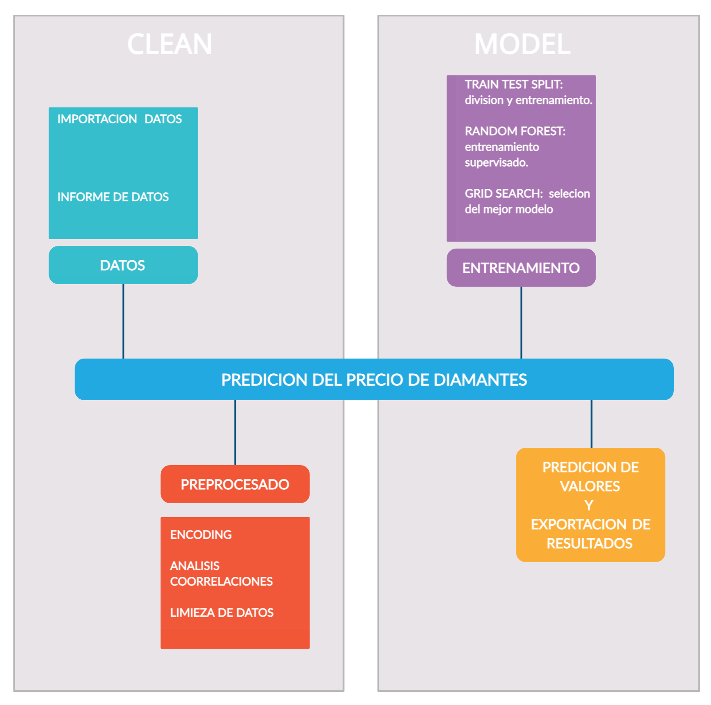

# Diamonds Predicting Prices kaggle competition  

# Objetivo 
El objetivo de este proyecto es el de entrenar modelos de machine learnig para predecir el precio de un listado de diamantes. El concurso consiste en la obtencion de un modelo predictivo con la puntuacion mas baja en el error cuadratico medio, Square mean error, durante un fin de semana teniendo en cuenta que se podian presentar hasta un maximo 5 prediciones diarias. 

# Proceso 
Partimos de una base de datos a entrenar (train.csv) y otra sin precios para predicir (test.csv).  
- Fase de limpieza: 
  -  Datos los datos y realizamos uhn analisis preeliminar. 
  -  Procesado: codificacion, analisis de correlaciones en busca de variables  y sus colaboraciones para el posterior descarte de aquellas poco explicativas. 
- Modelizacion:
  - Entrenamiento: diferentes procesos de entrenamiento usando librerias especificas. 
  - Prediciones y validacion: obtencion de prediciones y exportacion para presentar resultados para competicion. 

En el directorio note book se explica con detalle como se han obtenido los resultados presentes en el directorio data. 

